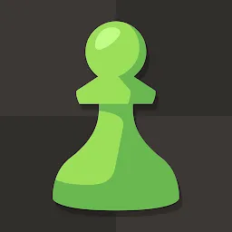
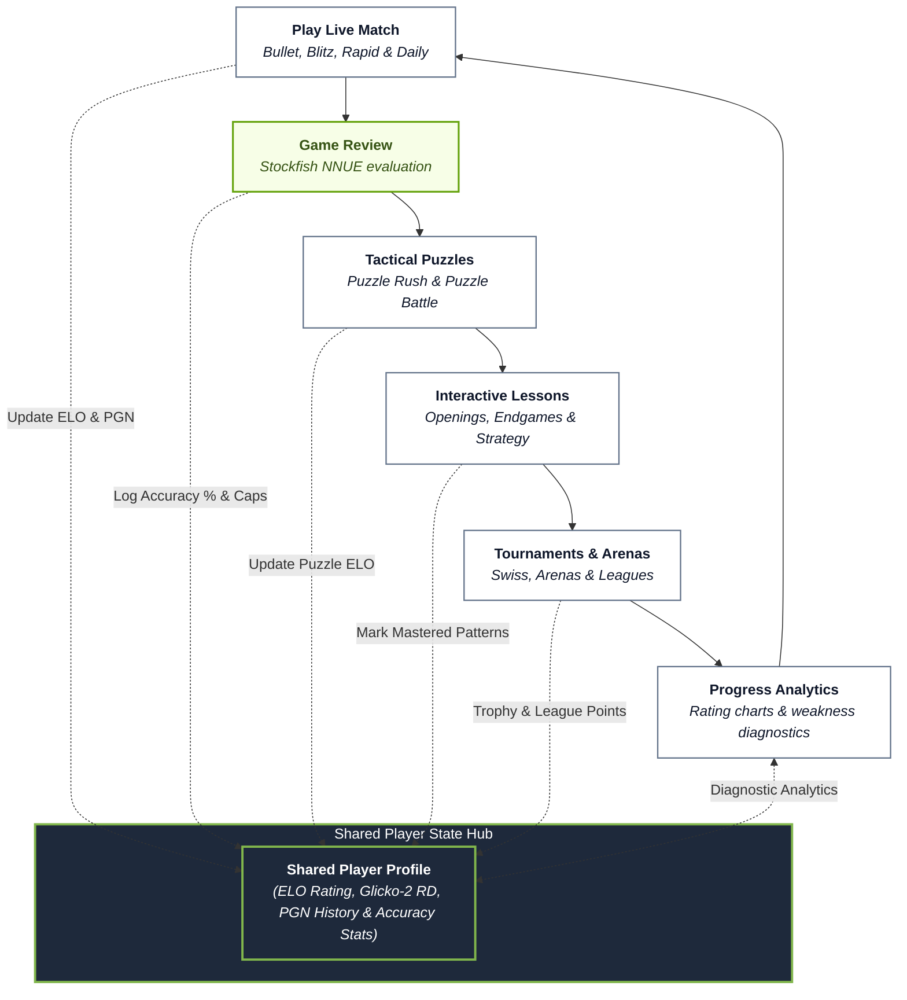

<p align="center">
  
</p>

<h1 align="center">Chess.com</h1>

<p align="center">
  <strong>The world's #1 online chess platform — play live games, solve tactical puzzles, analyze moves with Stockfish NNUE, and master chess with interactive lessons.</strong>
</p>

<p align="center">
  <a href="https://www.chess.com"></a>
  <a href="LICENSE"></a>
  
  
  
</p>

<p align="center">
  <em>Compete against players worldwide, challenge AI bots with distinct personalities, review your games with move-by-move accuracy ratings, and elevate your ELO.</em>
</p>

---

## 💡 Why Chess.com?

Chess has been played for over 1,500 years, but finding opponents, setting up physical boards, recording PGN moves, and analyzing mistakes used to require expensive clubs or private grandmaster tutors.

**Chess.com** transforms the classic game into a seamless, high-speed digital ecosystem. Match with opponents of your exact skill level within seconds, solve personalized tactical puzzles, and receive instant post-game grandmaster commentary powered by deep neural-network engine evaluation.

> *"Chess is the gymnasium of the mind."* — **Blaise Pascal**  
> Whether you're making your first pawn move or preparing for grandmaster tournaments, Chess.com provides the tools, community, and insights to master the game.

---

## ⚡ Platform Comparison (Traditional OTB vs. Chess.com)

<table>
  <thead>
    <tr>
      <th width="50%">♟️ Traditional Over-the-Board (OTB) Chess</th>
      <th width="50%">🌐 Chess.com Digital Ecosystem</th>
    </tr>
  </thead>
  <tbody>
    <tr>
      <td><b>Manual Matchmaking:</b> Requires physical travel, local chess clubs, or scheduling partners in advance.</td>
      <td><b>Instant Global Pairing:</b> Smart Glicko-2 matchmaking connects you with 150M+ players in < 3 seconds.</td>
    </tr>
    <tr>
      <td><b>Unassisted Analysis:</b> Hard to identify missed tactics or calculate complex 15-move variations independently.</td>
      <td><b>Stockfish 16 NNUE Game Review:</b> Instant move classification (Brilliant <code>!!</code>, Great <code>!</code>, Blunder <code>??</code>) & Accuracy %.</td>
    </tr>
    <tr>
      <td><b>Static Learning:</b> Heavy textbooks and static puzzle diagrams with no dynamic feedback.</td>
      <td><b>Adaptive Puzzles & Lessons:</b> Puzzle Rush, Puzzle Battle, interactive video lessons, and opening explorer.</td>
    </tr>
    <tr>
      <td><b>Manual Time & Score Keeping:</b> Requires physical clocks and handwriting move-by-move score sheets.</td>
      <td><b>Automated Clocks & PGN Logging:</b> Millisecond-precise clocks, premoves, auto-draw detection, and PGN export.</td>
    </tr>
    <tr>
      <td><b>Single Standard Variant:</b> Played only on classical 8x8 boards with fixed starting setups.</td>
      <td><b>Rich Variant Suite:</b> Play Chess960 (Fischer Random), 4-Player Chess, Bughouse, Crazyhouse, 3-Check & Atomic.</td>
    </tr>
  </tbody>
</table>

---

## 🏗️ System Architecture & Data Flow

Chess.com operates a closed-loop system architecture coordinating real-time matchmaking, Stockfish 16 NNUE evaluation, tactical puzzles, and rating progression around an active shared-memory player state hub.

### The Chess Mastery Loop (Shared Memory Flywheel)

Inspired by closed-loop state feedback loops, Chess.com coordinates matchmaking, game analysis, tactical training, and rating progression around a central **Player State & ELO Rating Hub**:



---

## 🎯 Core Capabilities & Feature Breakdown

<table>
<tr>
  <td width="33%" align="center">
    <h3>⚡ Live Matchmaking</h3>
    <sub>Play Bullet (1|0, 2|1), Blitz (3|0, 5|0), Rapid (10|0, 15|10), or Daily correspondence chess against 150M+ players.</sub>
  </td>
  <td width="33%" align="center">
    <h3>🤖 AI Personality Bots</h3>
    <sub>Challenge 100+ computer personalities ranging from beginner Mittens to Grandmaster bots (Martin, Nelson, Komodo, Stockfish).</sub>
  </td>
  <td width="33%" align="center">
    <h3>📊 Game Review & Caps</h3>
    <sub>Analyze every game with Stockfish 16 NNUE. Discover Brilliant moves (<code>!!</code>), Great moves (<code>!</code>), and accuracy percentages.</sub>
  </td>
</tr>
<tr>
  <td width="33%" align="center">
    <h3>🧩 Puzzles & Puzzle Rush</h3>
    <sub>Sharpen your tactics with 500,000+ tactical puzzles, 3-minute Survival Puzzle Rush, and head-to-head Puzzle Battles.</sub>
  </td>
  <td width="33%" align="center">
    <h3>📚 Lessons & Openings</h3>
    <sub>Master key chess concepts with interactive video courses, Opening Explorer, Master Games Database, and Endgame Trainers.</sub>
  </td>
  <td width="33%" align="center">
    <h3>🏆 Tournaments & Leagues</h3>
    <sub>Compete in daily Swiss tournaments, Arena style speed runs, weekly Leagues (Bronze to Champions), and Titled Tuesday events.</sub>
  </td>
</tr>
</table>

---

## 🔍 Detailed Component Breakdown

### 1. Stockfish 16 NNUE Evaluation Engine
- **Neural Network Architecture**: Combines traditional alpha-beta search with NNUE (Efficiently Updatable Neural Networks) for human-like positional evaluation.
- **Move Classifications**:
  - 🔷 **Brilliant (`!!`)**: A winning sacrifice or unexpected tactic that turns the game.
  - 🟢 **Great Move (`!`)**: The sole winning move in a critical position.
  - 🌟 **Best Move**: Top recommendation by Stockfish NNUE.
  - 🟡 **Inaccuracy (`?!`)**: Minor positional slip.
  - 🟠 **Mistake (`?`)**: Significant loss of evaluation advantage.
  - 🔴 **Blunder (`??`)**: Severe oversight giving away material or checkmate.

### 2. Live Matchmaking & Rating System (Glicko-2)
- **Dynamic Rating Adjustment**: Calculates ELO changes based on win/loss/draw outcome, opponent's rating, and Rating Deviation (RD).
- **Fair Play & Cheat Detection Engine**: Analyzes move timing distributions, engine correlation percentages, and behavioral signatures to guarantee clean play.

### 3. Comprehensive Variant Suite
- **Chess960 (Fischer Random)**: 960 randomized starting positions to eliminate opening memorization.
- **Bughouse & Crazyhouse**: Team-based 2v2 chess where captured pieces can be dropped back onto the board.
- **4-Player Chess**: Played on a custom 16x16 board with 4 players in FFA or Team mode.

---

## 📁 Repository Structure & Artifacts

```text
Un/
├── sources/                     <-- Decompiled Application Sources & Extracted Assets
│   ├── decompile_cee/           <-- CEE Chess Engine wrapper & engine binding components
│   ├── decompile_contacts/      <-- Contacts, friends & social invite modules
│   ├── decompile_uci/           <-- Universal Chess Interface (UCI) engine integration
│   ├── decompile_webview/       <-- Web view controllers & interactive bridge components
│   ├── dex_extracted/           <-- Extracted DEX strings, symbols & type mappings
│   ├── native_libs/             <-- Native compiled libraries (libcee.so, libhermesvm.so, etc.)
│   ├── res_out/                 <-- Extracted APK resources, graphics, XMLs & manifests
│   ├── com.chess.apk.part1      <-- Split binary archive (Part 1)
│   └── com.chess.apk.part2      <-- Split binary archive (Part 2)
│
├── tools/                       <-- Binary analysis & decompilation tools (jadx, etc.)
│
├── assets/                      <-- High-Resolution Branding & App Icons
│   ├── app_icon.png             <-- Official Green Pawn App Icon (PNG)
│   ├── logo.png                 <-- High-resolution branding logo
│   └── app_icon.webp            <-- Vector-raster WebP icon asset
│
├── SECURITY_ANALYSIS.md         <-- Comprehensive security assessment & audit report
├── manifest.json                <-- Package metadata & decompilation inventory
└── README.md                    <-- Comprehensive Project & Platform Guide
```

---

## 🛠️ Technical Specifications

| Property | Details |
| :--- | :--- |
| **Platform Name** | Chess.com Mobile & Engine Ecosystem (`com.chess`) |
| **Core Chess Engine** | Stockfish 16 NNUE & CEE Native Engine (`libcee.so`) |
| **Runtime Environment** | React Native Hermes (`libhermesvm.so`) + Native Android C++ |
| **Matchmaking Algorithm** | Glicko-2 Rating System with Dynamic RD |
| **Protocol Support** | PGN (Portable Game Notation), FEN (Forsyth–Edwards Notation), UCI |
| **Real-time Gateway** | WebSockets (Socket.io / WSS) with binary frame packing |
| **Database & Cache** | SQLite local device cache + Cloud PGN sync |

---

## 📦 Reassembling the APK

To assemble `com.chess.apk` from the repository's split parts:

### Windows (CMD / PowerShell):
```cmd
copy /b sources\com.chess.apk.part1 + sources\com.chess.apk.part2 sources\com.chess.apk
```

### Linux / macOS:
```bash
cat sources/com.chess.apk.part1 sources/com.chess.apk.part2 > sources/com.chess.apk
```

---

## 🎨 Asset Resources

This repository includes official high-resolution assets located in [`assets/`](assets/):
- ♟️ **Green Pawn App Icon (PNG)**: [`assets/app_icon.png`](assets/app_icon.png)
- 🖼️ **High-Res Logo (PNG)**: [`assets/logo.png`](assets/logo.png)
- 🌐 **WebP Vector Asset**: [`assets/app_icon.webp`](assets/app_icon.webp)

---

## 📄 License

Distributed under the [MIT License](LICENSE). Copyright &copy; 2026 [Arafath Rahman](https://github.com/smartworldarafath).
